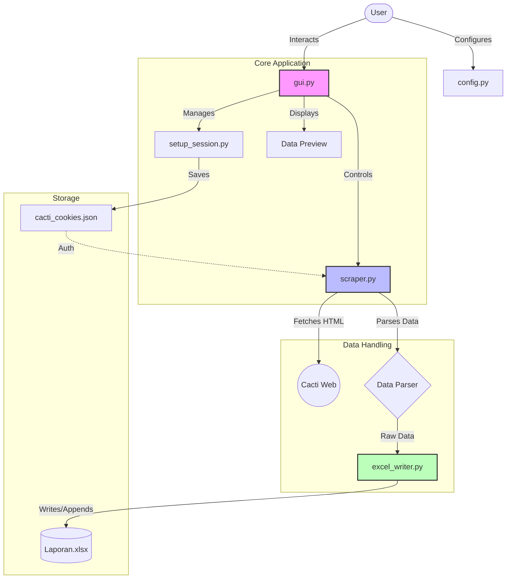

# 🌵 Cacti AutoData Scraper

Aplikasi otomasi untuk mengambil data bandwidth dari Cacti monitoring system dan merekapnya ke dalam format laporan Excel secara otomatis.


## ✨ Fitur Utama

- **🚀 GUI Modern & Mudah**: Antarmuka grafis yang user-friendly dengan tema modern.
- **⚡ Fast Scraping Mode**: Menggunakan metode `requests` langsung (bukan Selenium) untuk kecepatan maksimal.
- **📊 Excel Otomatis**:
  - Menulis data ke file Excel yang sudah ada atau membuat baru.
  - Mendukung format laporan standar (Tanggal, Waktu, In/Out Current, Max, Avg).
  - **Smart Append**: Menambah baris baru tanpa merusak data lama.
  - **Status Preview**: Melihat status data sebelum ditulis (New, Updated, Skipped).
  - **Sheet Metadata**: Menyimpan info eksekusi (User, Waktu, URL) di sheet terpisah.
- **🛡️ Data Safety**:
  - **Retry Mechanism**: Jika file Excel sedang terbuka saat penyimpanan, program akan meminta konfirmasi Retry (tidak langsung error/crash).
  - **Skip Filled Rows**: Opsi untuk melewati baris yang sudah terisi agar tidak menimpa data manual.
- **🔧 Fleksibilitas**:
  - **Interface Mapping**: Bebas memetakan nama Interface Cacti ke nama Sheet Excel.
  - **Date Picker**: Memilih rentang tanggal dengan mudah.
  - **Skip Weekend**: Opsi otomatis melewati hari Sabtu & Minggu.

## 🛠️ Persyaratan Sistem

- Windows / Linux / MacOS
- Python 3.8 atau lebih baru
- Google Chrome (untuk pengambilan cookie awal)
- Akses jaringan ke server Cacti (VPN jika diperlukan)

## 📦 Instalasi

1. **Clone Repository**
   ```bash
   git clone https://github.com/username/cacti-autodata.git
   cd cacti-autodata
   ```

2. **Buat Virtual Environment (Opsional tapi Disarankan)**
   ```bash
   python -m venv venv
   # Aktifkan venv:
   # Windows:
   venv\Scripts\activate
   # Linux/Mac:
   source venv/bin/activate
   ```

3. **Install Dependencies**
   ```bash
   pip install -r requirements.txt
   ```

## ⚙️ Konfigurasi Awal

1. **Siapkan File Config**
   Salin `config.example.py` menjadi `config.py`:
   ```bash
   cp config.example.py config.py
   ```

2. **Edit `config.py`**
   Sesuaikan variabel berikut dengan lingkungan Anda:
   - `CACTI_URL`: URL halaman Graph View Cacti Anda.
   - `INTERFACE_TO_SHEET`: Mapping nama interface di Cacti ke nama Sheet di Excel.
   - `TIME_SLOTS`: Jam berapa saja data diambil (Default: 09:00 dan 16:00).

3. **Ambil Cookie Login (Satu Kali Saja)**
   - Buka aplikasi GUI (`python gui.py`).
3. **Ambil Cookie Login (Satu Kali Saja)**
   - Buka aplikasi GUI (`python gui.py`).
   - Masuk ke tab **Settings**.
   - Klik tombol **Login / Update Session**.
   - Ikuti petunjuk di layar:
     1. Buka Cacti di browser Anda (Chrome/Edge).
     2. Tekan F12 > Application > Cookies.
     3. Copy value dari cookie `Cacti` atau `PHPSESSID`.
     4. Paste ke kolom di aplikasi.
   - Selesai! Cookie tersimpan otomatis.

## 🚀 Cara Penggunaan

1. **Jalankan Aplikasi GUI**
   ```bash
   python gui.py
   ```

2. **Langkah-langkah di Aplikasi**:
   - **Pilih File Excel**: Klik "Browse" untuk memilih file laporan bulanan (xlsx).
   - **Pilih Tanggal**: Tentukan Tanggal Mulai dan Tanggal Akhir.
   - **Interface Map**: Centang interface mana saja yang ingin diambil datanya.
   - **Settings (Opsional)**:
     - *Skip Weekend*: Lewati Sabtu/Minggu.
     - *Include Metadata*: Tambahkan sheet info timestamp/user.
     - *Skip Filled Rows*: Jangan timpa baris yang sudah ada isinya.
   - **Klik START**: Proses scraping akan berjalan.

3. **Monitor Proses**:
   - Lihat progress bar dan log aktivitas di bagian bawah.
   - Tab **Preview** akan terisi otomatis dengan data yang diambil.
   - Status kolom di Preview akan menunjukkan:
     - `New`: Data baru ditambahkan.
     - `Updated`: Data lama diperbarui.
     - `Skipped (Filled)`: Data dilewati karena sudah ada isinya.

4. **Simpan**:
   - Data otomatis disimpan ke file Excel setelah proses selesai.
   - Jika file Excel sedang terbuka, akan muncul popup **Retry**. Tutup Excel lalu klik Retry.

## ⚠️ Troubleshooting

**Q: Error "Permission denied" saat menyimpan?**
A: Pastikan file Excel tujuan **DITUTUP**. Program tidak bisa menyimpan jika file sedang dibuka di Excel. Klik "Retry" pada popup setelah menutup file.

**Q: Data tidak muncul / Kosong (0 rows)?**
A:
- Cek koneksi internet / VPN ke server Cacti.
- Cookie mungkin expired. Jalankan `python setup_session.py` lagi.
- Pastikan Nama Interface di `config.py` atau GUI sesuai persis dengan yang ada di Cacti.

**Q: Status kolom selalu "Pending"?**
A: (Solved) Versi terbaru sudah menampilkan status realtime (`New`, `Updated`, `Skipped`). Pastikan Anda menggunakan kode terbaru.

## 📝 Struktur Project

- `gui.py`: Entry point aplikasi utama (GUI).
- `scraper.py`: Core logic untuk scraping data (multithreaded).
- `excel_writer.py`: Modul untuk membaca/menulis file Excel secara aman.
- `config.py`: File konfigurasi user.
- `setup_session.py`: Script pembantu untuk login & ambil cookie.
- `cacti_cookies.json`: File penyimpan sesi login (jangan dishare!).

## 📄 License
Project ini dibuat untuk penggunaan internal tim monitoring.

## 🏗️ Arsitektur & Alur Kerja

### Diagram Arsitektur
Gambaran bagaimana modul-modul saling berinteraksi:



### Flowchart Proses Utama
Alur logika dari mulai sampai data tersimpan:

```mermaid
flowchart TD
    Start([Mulai]) --> CheckCookie{Cookie Valid?}
    
    CheckCookie -- No --> Login[Input Cookie Manual\n(di GUI Settings)]
    Login --> SaveCookie[Simpan ke JSON]
    SaveCookie --> CheckCookie
    
    CheckCookie -- Yes --> Setup[Pilih Tanggal & File Excel]
    Setup --> Config[Pilih Interface & Options]
    Config --> Run[Klik START]
    
    Run --> ScraperLoop{Loop Tanggal}
    
    subgraph Scraping Process
        ScraperLoop -->|Next Date| Fetch[Request ke Cacti]
        Fetch --> Parse[Ambil Data Tabel]
        Parse --> Valid{Data Valid?}
        Valid -- No --> LogError[Log Error]
        Valid -- Yes --> Buffer[Simpan di Memory]
    end
    
    Valid -->|Next| ScraperLoop
    LogError -->|Next| ScraperLoop
    
    ScraperLoop -- Selesai --> WriteExcel[Tulis ke Excel]
    
    WriteExcel --> FileOpen{File Terbuka?}
    FileOpen -- Ya --> Popup[Show Retry Dialog]
    Popup --> UserClose[User Tutup Excel]
    UserClose --> Retry[Klik Retry]
    Retry --> WriteExcel
    
    FileOpen -- Tidak --> Save[Simpan File .xlsx]
    Save --> ShowResult[Tampilkan Popup Sukses]
    ShowResult --> Finish([Selesai])
```
